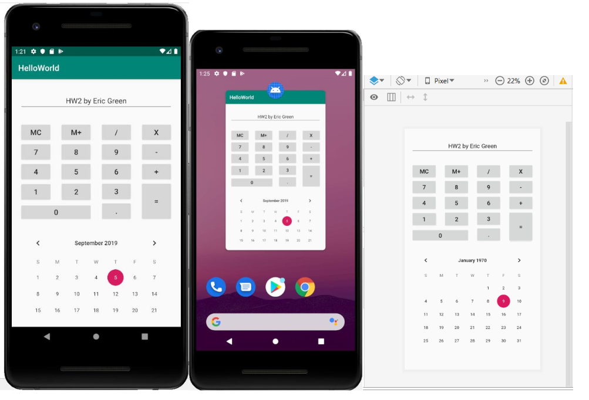

## CS4337: Human-Computer-Interaction
## HW 2: Build an interface using Android Studio

In this assignment, you will use Android Studio to build an App’s interface (without functions). The objective is to get
familiar with views, layouts, and attribute settings.
The App contains a calculator and a calendar. The default text on the upper region of the whole screen will be “HW2
by FirstName LastName”. Here you should use your name in this string.
Please **submit the .xml file** of the screen and ***three screenshots** (like the below images) including:
1. the App interface on an emulator/real device (left),
2. the App on the background of the Android system (middle), and
3. the design view in Android Studio (right).
   
To be specific,
- The App interface should contain three parts: the text view, the calculator buttons, and the calendar (30 pts)
- The whole screen should have top, bottom, left, and right margins set to 20dp (5 pts)
- The text of the TextView should align to the center (5 pts)
- The calculator buttons (including digits and text on them) should be placed exactly according to the shown layout (25 pts)
- The calendar shows your submission date (5 pts)
- The screenshots of running the App (i.e. the left and the middle) (30 pts).

